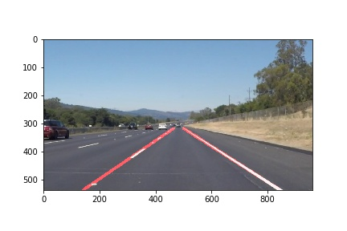

# Finding Lane Lines on the Road

## Progress Writeup

---
**Finding Lane Lines on the Road**
The goals of this project are as follows:
* Make a pipeline that finds lane lines on the road
* Reflect on the work done in a written report 
---

## Reflection

## 1. Process Description  -  process_image()

My pipeline consisted of 6 steps in all. I began by converting the image to grayscale. Once I had the grayscale image, I applied Canny Edges algorithm to find gradient changes. While doing that, I had to work on the threshold values to include only the significant edges, lane lines in our case. After that, through trial and error, I chose a quadrilateral region of the image, that picked only the lanes.

Now that I had a region, I applied Probabilistic Hough Transform on the edges to detect the lines drawn. To draw these lines, I created a blank image of the same dimensions. Using the following formula $$ m = \frac{y_2 - y_1}{x_2 - x_1}$$ and the line coordinates returned by the Hough Transform, I calculated average slopes and coordinates separately for the right and left line. 
Finally, I combined the lanes drawn with the original color image and found the following output:
<figure>
 
 <figcaption>
 

 
 
 The Final Output
 
 </figcaption>
</figure>

## 2. Potential Shortcomings
One shortcoming that I see is the average slope calculated. If a sharp turn or change in inclination was to happen, the lines would be off and the lanes could be wrongly calculated.

Another shortcoming is the narrow mouth of the region of interest (ROI). In case a brightly colored vehicle reflected the Sun, it would form a sgnificant gradient change to fall in the lane

The function doesn't take into account the presence of cars closer than the lower limit of ROI. This can lead to incorrect line detections

## 3. Possible Improvements
One improvement could be the breakdown of each line into half its length so that we have two averaged slopes each. This way we can accomodate sudden changes in the road conditions

Make code robust enough to accomodate changes such as those in the challenge video

